# TreasureHuntGame 寻宝游戏

本项目为 ECNU_DaSE《当代数据管理系统》第一个Project，本人使用Python重量级框架Django和pymongo构建了整个Web应用(并不使用Django-Models层ORM，但是session记录依然使用Django自带的session记录方法，并未存入MongoDB数据库)。**这是一项完成度较高 可以直接上线去玩的Web应用(类似于原始抽卡游戏)**

- 2021/10/3 - 完成项目整体搭建**前后端不分离，html使用Django模板层渲染**（还有背包自动删除功能未实现，个人并未学习过前端，因此为了迎合前端样式，POST和GET混用）

- 2021/10/10 - **重新整理了整体框架** 新增**testproject** app，可以通过浏览器直接输入固定形式的请求或用postman GET请求即可完成一些操作(当然也可以全部改成POST版本) **此app(结合function.py)可以直接搭建另一套POST/GET确定的以json为交互的服务,也便于转向flask框架使用**（此app高度整合了所有功能 主体400+代码 function100+代码 **基本临界条件都有优化**） 同时方便**前后端分离**

- 2021/10/10 - 新增系统设定 -- **背包中宝物自动删除**功能，可以在寻宝or购买背包空间不足时自动选出功能最差的宝物，将其删除，将空余的空间留给新宝物，无需手动操作（此功能只在testproject app中实现，**未完全实现到整体网站上**，因前端未适配，只能通过testproject操作）

- 2021/10/10 - 优化宝物获得算法，使得终极宝物获取**概率提升**。

- 2021/10/11 - 增加系统设定 -- **自动工作**  并未配置到settings中，通过**工作url设置**（此功能只在testproject app中实现，**未完全实现到整体网站上**，因前端未适配，只能通过testproject操作）

- 2021/10/11 - **优化了testproject app的数据库CRUD操作**，使其不使用update一整个文档，而是使用update_one(查找条件, update, options)，加强了数据库语言的学习使用

- 2021/10/12 - **前端优化了pc端个人界面**，增加分页选项，优化商城界面，**优化整体图标UI**，增加显示自动工作，自动清理信息

- 2021/10/15 - **前后端大更新，学习了一些前端知识，规定了GET是获取页面(返回值是html)、POST是各种操作(返回值是json)，将testproject整合优化的函数回写到各个视图函数(view)，并对前端html进行优化**，**优化宝物界面**，所有关于宝物的二级页面均使用bootstrap模态框，在个人以及商城界面可以少请求一次后端，寻宝也进行优化，使用ajax不刷新页面发送请求更新模态框显示。（自动清理的开关还加入，无法点击切换，自动工作可以点击实现切换自动工作：开/关）

- 2021/10/16 - 修复了前端form表单自动提交导致http连接断开的bug

- 2021/10/16 - **优化了手机端前端UI**，并增加了线程锁，优化了寻宝请求过多导致宝物删除未完成的bug（实际还是有点bug），增加了自动清理的前端点击事件。

- 2021/10/16 - 增加通关证明，在user文档里增加一项 finish（1表通关0表未通关），只需要佩戴着“外星战衣”即可通关，会在主页显示通关字样。

- 后续 - 优化前端，使前后端分离（未实现）

---
**testproject测试：**
浏览器 or postman 需输入url 以及对应参数

操作包括：

url(GET)|操作|参数(json)|返回值(json)
--|:--:|--:|--:
127.0.0.1:8000/test/user/|注册/登录/退出登录|{'username':'xxx', 'password':'xxx'}|{'success'or'error':'xxx'}
127.0.0.1:8000/test/getall/|获取用户所有信息|无参数(获取的是session，因此需先登录)|{'user':如下文档1, 'wearitems':[如下文档2], 'backpackitems':[如下文档2]} 
127.0.0.1:8000/test/work/|工作|{'work':'auto'/'manual'/'once'}(设置自动手动或单纯工作一次，自动时无法进行工作一次操作)|{'success'or'error':'xxx'}
127.0.0.1:8000/test/hunt/|寻宝|{'times':int}(设定不超过10)|{'success'or'error':'xxx', 'items':[如下文档2]}
127.0.0.1:8000/test/operate/|佩戴/取下/丢弃|{'f':'wear'or'backpack'or'discard', 'iid':'宝物的id'}|{'success'or'error':'xxx'}
127.0.0.1:8000/test/market/|浏览/购买/出售/回收|{'f':'view'or'buy'or'sell'or'retrieve', 'iid':'宝物的id'(当f为view时无用), 'price':'int'(仅当f为sell时有用)}|{'success'or'error':'xxx'}
127.0.0.1:8000/test/settings/|设置(仅自动清理)|{'setting':'xxx', 'operate':'xxx'}|{'success'or'error':'xxx'}

---

文档1
```
{
    'username':username,
    'password':password,
    'gold_num':xxxx,
    'work_efficiency':xx,
    'lucky_value':xx,
    'wear':{
        'tool_num':x,
        'ornament_num':x,
        'totipotent_num':x,
    },
    'backpack':xx,
    'auto_clean':0/1,
    'auto_work':0/1,
    'finish':0/1,
}
```
文档2
```
{
    'buid':xxxx,
    'name':itemname,
    'grade':x,
    'info':'xxxx',
    'type':x,
    'work_efficiency':xx,
    'lucky_value':xx,
    'state':'xx',
    'price':xxx,
}
```

## 作业要求：(略有修改)

考虑以下游戏场景：

- 每个游戏玩家都有一定数量的金币、宝物。有一个市场供玩家们买卖宝物。玩家可以将宝物放到市场上挂牌，自己确定价格。其他玩家支付足够的金币，可购买宝物。
- 宝物分为两类：一类为工具(tool)，它决定持有玩家的工作效率；一类为配饰(ornament)，它决定持有玩家的运气。
- 每位玩家可以通过消耗10金币寻宝获得一件宝物，宝物的价值由玩家的运气决定。
- 每位玩家每天可以通过劳动赚取金币，赚得多少由玩家的工作效率决定(100*工作效率)。
- 每个宝物都有一个自己的名字。每位玩家能够佩戴的宝物是有限的（一个玩家只能佩戴**两个工具**和**两个配饰**）。
- 存储箱(背包)中存放多余的宝物(但佩戴中的宝物和挂牌中的宝物皆在背包中占有空间)，不起作用，但可以拿到市场出售。
- 当存储箱装不下时，**运气或工作能力值最低的宝物将被系统自动回收**(个人实现了用户选择自动丢弃或不自动丢弃)。
- 在市场上挂牌的宝物**必须在存储箱中并仍然在存储箱中**，直到宝物被卖出。挂牌的宝物可以被收回，并以新的价格重新挂牌。
- 假设游戏永不停止而玩家的最终目的是获得最好的宝物。

根据以上场景构建一个假想的Web游戏，可供多人在线上玩耍。后台的数据库使用MongoDB。

对游戏玩家提供以下几种操作：

- 寻宝（手动点击寻宝，消耗10金币并且根据幸运值获得宝物）
- 赚钱（手动点击工作一次，获得工作效率*100的金币数/也可自动每十分钟执行一次赚钱操作）
- 佩戴/取下/丢弃宝物
- 浏览市场、购买/挂牌/回收宝物。

---

提交：程序+文档

要求：

- 文档主要用于解释你的数据库设计，即需要构建哪些collection，每个collection的文档结构是什么，需要构建哪些索引，应用如何访问数据库（具体的CRUD命令）。
- 为玩家的操作设计JSON HTTP协议的接口，自定义接口格式（request和response的JSON），为每个接口编写测试用例和测试代码，并在文档中包含测试结果。(未理解意义)
- 不限制编程语言及web框架。

---

## 数据库设计

### 分析

#### 1、分析宝物和宝物类型文档集是否区分

每个**不同的宝物(item)**由于**状态会不相同**(佩戴中/在背包/挂牌中)，因此每个宝物(item)都需要一个文档来存储，而宝物的种类则用不同的文档集来存储。

宝物的信息(名字，简介，功能等)需要考虑**占用的存储**和**查询效率**，来决定是**将宝物的信息存在item中**还是**item文档只存储状态和一个指向宝物种类的序号(ObjectId)**

个人选择是将宝物信息直接存在了每个item中，因此消耗的存储空间会变大一些，但是无需每次每个物体要取其在宝物种类中的id，这种做法较为简易，减少了一次与数据库的交互。

#### 2、分析用户和宝物文档集是否需要分离

若宝物文档嵌入在用户文档中，那么每次进行宝物的增加、减少时需要频繁的扩大、减小文档，且商城购买时需要遍历所有用户取出其正在挂牌中的item，较为繁琐，个人不建议嵌入。

---

个人想过以下几种方案：

1. 宝物文档嵌入用户文档，但是维护另一个文档集market_item，其内容为一个ObjectId指向用户的宝物文档和价格属性。
2. 宝物文档不嵌入用户文档，将价格属性直接加入item文档中，然后用户文档集中添加tool和ornament属性，内容分别是工具和饰品的宝物ObjectId，但在item文档中不添加其属于的用户
ObjectId。
3. 宝物文档不嵌入用户文档，将价格属性直接加入item文档中，在item文档中添加其属于的用户ObjectId(记为uid)，但在用户文档中不添加任何关于item的信息。(由于我们可以在每次操作的时候将所有属于此用户的文档全部拿出来，理论上是可以实现所有功能的)
4. 宝物文档不嵌入用户文档，将价格属性直接加入item文档中，然后用户文档集中添加有关item的属性，内容是宝物的ObjectId，在item文档中添加其属于的用户ObjectId(记为uid)。
5. 宝物文档不嵌入用户文档，将价格属性直接加入item文档中，然后用户文档集中添加有关item数量的属性，内容是宝物的数量，在item文档中添加其属于的用户ObjectId(记为uid)。

---

为了商城的实现简易以及需要联动改动的操作减少，个人觉得应该需要将宝物(item)文档与其所对应的用户(user)分离开，因此排除第一种方案；

因而考虑第二种方案，考虑item文档不加所属用户id而用户文档添加拥有item id，此方案在“购买”操作时需要同时更新双方用户的数据库，此时需要进行两次数据库操作，且不为原子操作，所以可能会发生错误，即在更新完其中一个user时，服务器宕机使得第二个user并没有更新上，此时某个item会处于同时属于两个人或不属于任何人状态**且有时候用户难以发现**，而且此宝物可能会流传很久后才被发现，无日志的话不可追溯，引发安全问题。

因而考虑第三种方案，只在item侧添加属于user的属性，此方案在“购买”时不会出现item不会出现第二种方案的bug(若更新为原子操作)，若单纯是更改金币的时候出现bug用户可以察觉，也可以反馈。但是此方案需要频繁访问item数据库，取出所有与user相关的item在很多操作的时候并不是必要的，**效率较低**。

因而考虑第四种方案，此方案可以解决“购买”宕机问题，因为可以对user和item双方都进行一遍判定来确保此物确实在此时属于此用户，可以防止出bug的物品流传出去难以追踪(因为在出售物品的时候肯定要先判定此物品属于此用户才可以进行)，此方案可行。

再考虑第五种方案，此方案在user端只存数字，代表数量，而不存具体的ObjectId，首先这种方案在文档存储方面肯定消耗较少存储空间，其次是在获取属于某用户的item时，可以对item的belong uid建立索引，这样可以直接获取相同uid索引的所有文档，对比第四种方案效率应该不会差(理论上应该是将第四种的文档种的存储空间花费在了索引上，虽然没有具体了解是如何构建的索引，但是感觉索引很厉害的样子，应该消耗空间和在文档中差不多吧，然后效率应该也好一点)，而且这种方案在编写代码的时候也比较简单，只需更改数字，而不需要扩大or缩小数组。

**因此我选择的是第五种方案，简单且不易错**，当然咱们这种小游戏应该不会出大问题，因此所有方案都可以试一试。

### 用户(user)

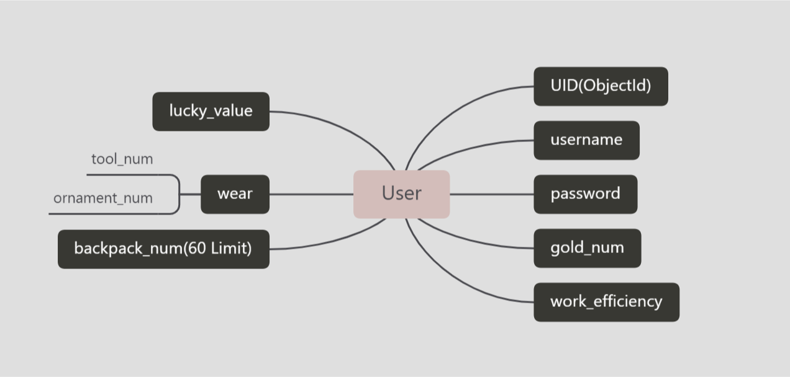

```
{
    'username':username,
    'password':password,
    'gold_num':xxxx,
    'work_efficiency':xx,
    'lucky_value':xx,
    'wear':{
        'tool_num':x,
        'ornament_num':x,
        'totipotent_num':x,
    },
    'backpack':xx,
    'auto_clean':xx,
    'finish':0/1,
}
```

### 物品(item)

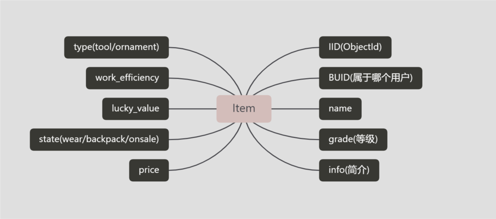

```
{
    'buid':xxxx,
    'name':itemname,
    'grade':x,
    'info':'xxxx',
    'type':x,
    'work_efficiency':xx,
    'lucky_value':xx,
    'state':'xx',
    'price':xxx,
}
```

### 物品种类(item_type)

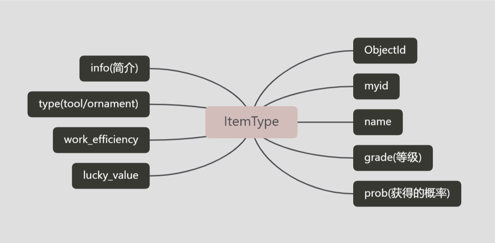

## 页面设计(前端样式)

### 登录
登录界面单纯抄模板。

### 主页
用户主界面，可以进入（我的、商城）界面，也可以进行（工作、寻宝）操作。
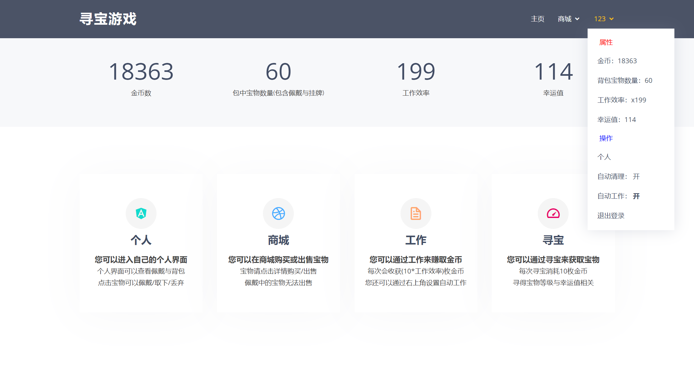

### 我的(个人界面)
用户个人界面，在此界面可以进行宝物佩戴/取下/丢弃操作。
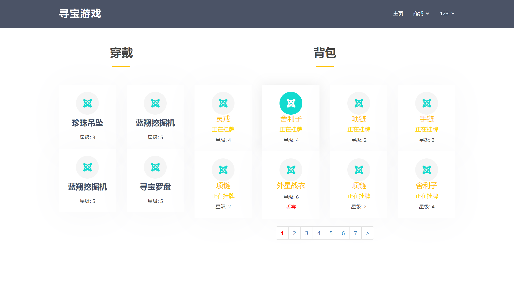

### 商城(分为购买与出售)
商城界面，此界面为多人在线交互界面，因此也单独列出来，点击每个宝物可进入宝物具体界面然后进行具体操作。

购买界面
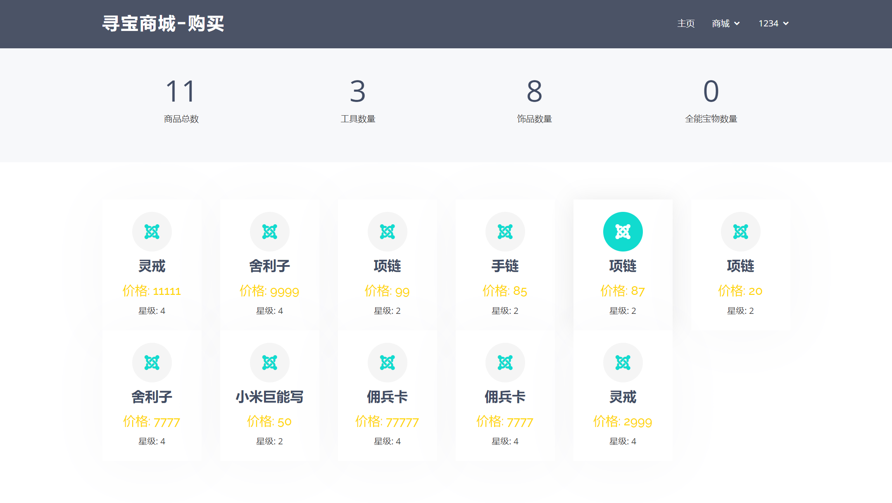

出售界面
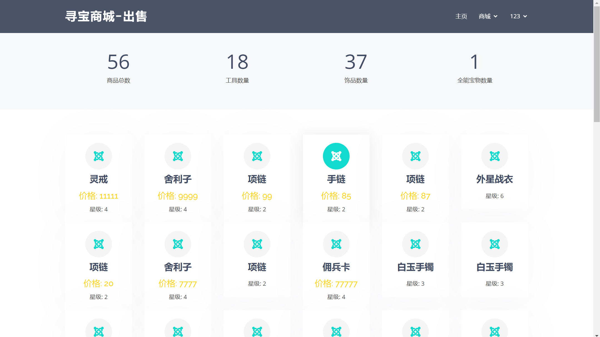

### 宝物
将宝物界面使用同一套模态框进行呈现，较为方便直观。且个别地方减少http请求

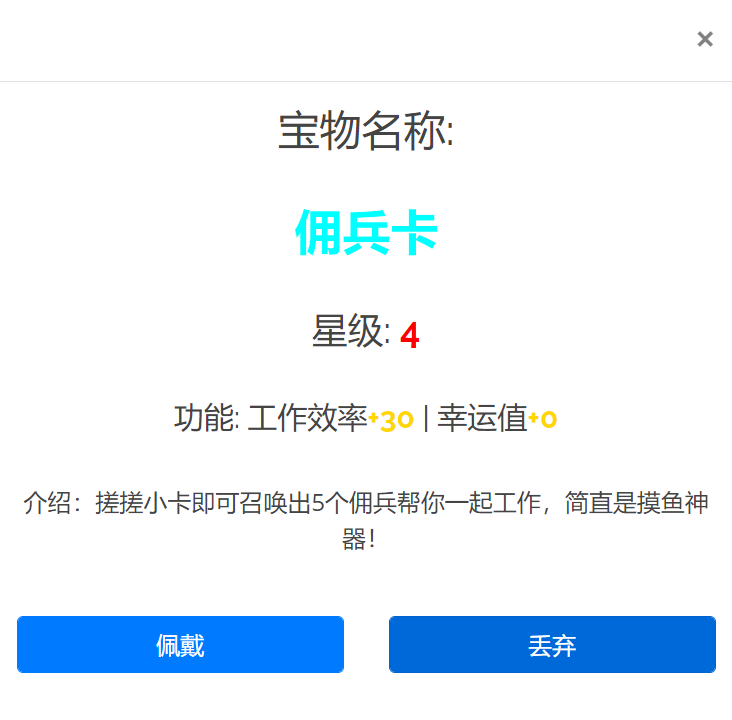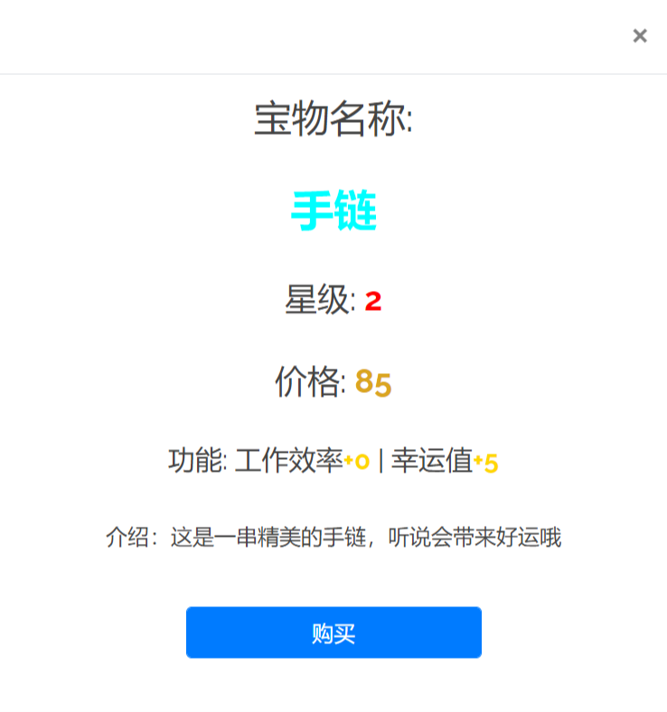

## 功能实现

所有功能分为 (注册/登录/退出)/工作/寻宝/(佩戴/取下/回收)/商城

---
其中需要注意的点有：

- 写入数据库时需要try来防止并发请求
- 每个视图函数都要检查数据库是否连接
- 除登录/注册外每个视图函数执行前都需要检查是否已登录
- 购买/寻宝 时都需要考虑金币数量和背包剩余空间
- 由于json文件无法识别ObjectId，因此需要有一个 ObjectId to str 的函数将每个文档转换

---

功能模块如下：
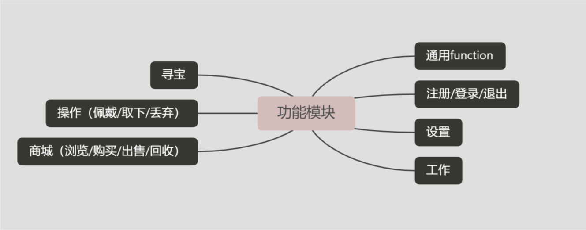

通用function（便于视图函数调用）如下：
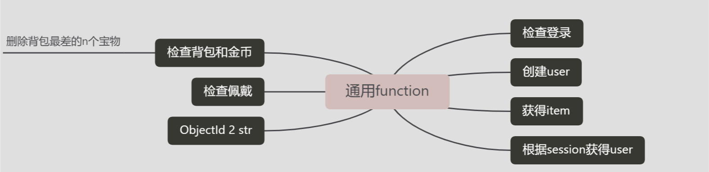

### 注册/登录/退出

#### 注册

注册时需要考虑用户名username的问题，本项目以username作为不同用户的区分，因此需判断username是否在数据库中已存在。若无，则可以初始化user文档并写入数据库，然后返回到登录界面；若有则返回用户名重复，请修改用户名的提示。
**其中写入数据库时需要try来防止并发请求，若并发请求，则打印报错，并返回服务器错误的提示**

#### 登录

登录时需判断用户名和密码是否匹配，若无用户名or密码不匹配则输出“用户名或密码错误，请重试”。若用户名和密码匹配则设置session，使服务器记住当前用户的浏览器。

#### 退出登录

将设置好的session删除跳转到登录界面即可

### 工作

工作是最简单的一部分，只需接收到前端的请求，将session中记录的user从数据库中读取出并修改其金币数量再写回数据库即可。**需要try**

### 寻宝

寻宝分成两个部分，第一步根据幸运值获得宝物，第二步修改宝物以及获得此宝物的用户信息存入数据库。

#### 宝物获取

个人采用了一种**资源池**的概念，建立一个大小为n的数组，其中的数据为整型，代表了某种宝物(我在item_type时设定了一个myid定义的就是宝物的id号，人手动输入，保证不相同)，然后数据库读取item_type中所有的文档，对于每个宝物，获取其概率和等级，然后据此使用一算法：

向资源池添加的数量 = n * 概率 * (1 + 幸运值 * 等级 * a)(a 为固定参数)

然后数组中个数不足n的按0添加

此算法可以根据幸运值的提升来提高获得物品的可能性，而且幸运值越高等级越高的物品获得概率越大，等级越低的物品获得概率虽然也增大但是增大幅度比等级高的物品小。**十连抽按此算法也能提高中奖率哦**(当然也可以多加一个关于多抽的参数)

当然此算法还可以优化，项目不做具体优化。

#### 更改宝物和用户信息

将宝物的所属用户id更改，将用户的背包中物品数量更改，然后写入数据库即可。**需要try**

这里需要判断背包是否已满，也需要清理背包空间(将最垃圾的一个不在挂牌的宝物删掉)。此处我将把是否自动清理背包设置成用户文档的一个属性，便于用户自己调整。当然这个操作在购买的时候也会遇上，所有可以**封装成一个check_backpack函数**调用。

### 佩戴/取下/回收

这三个请求都需要判断item是否属于当前浏览器操作用户，防止恶意操作。

#### 佩戴

佩戴宝物时需要判断是否达到佩戴上限(本项目设置佩戴上限为2工具2饰品，另加最后终极宝物佩戴后会触发您已过关的提示，当然终极宝物佩戴时不能佩戴其他任何宝物，且只能佩戴一件)

还需要判断此宝物是否在背包中(正在挂牌额物品无法佩戴，已佩戴的物品防止用户恶意操作)

若可以佩戴，则将宝物的状态改为wear，并根据宝物的属性增加用户的工作效率和幸运值，再将用户的正在佩戴的饰品数量或工具数量更新，最后将更新好的数据写入数据库**同样需要try**

#### 取下

取下时需要判断此宝物是否正在佩戴，若不在佩戴则不执行取下操作。

若可以取下，则将宝物的状态改为backpack，更新工作效率和幸运值，更新佩戴数量，写回数据库**同样需要try**

#### 丢弃

丢弃请求需要判断此宝物是否在背包中(不在挂牌也不在佩戴)，然后将用户中背包宝物数量-1，写回数据库**try**

### 商城

这也是整个项目中最难的一部分，分为出售界面和购买界面。其中购买界面只显示不属于当前用户的onsale的item，可供当前用户购买；而出售界面则显示属于当前用户的不在佩戴中的item，可供当前用户将背包中的物品出售/回收。这里可以发很多攻击的请求，我将部分不合理操作的请求直接以**操作错误**返回。

进行所有操作的时候都需要判断操作对象item是否存在。若不存在则返回操作错误。

#### 购买

首先判断当前item是否在onsale状态，其次判断是否当前用户和item所属用户不相同(防止有人闲得慌)。然后再判断是否能够购买(使用寻宝时封装的函数)，若能购买，则更新卖家信息，将其金币数量+price，背包中宝物数量-1；然后更新买家信息，金币数-price，背包中宝物数量+1；最后更新item信息，将状态改成backpack，属于的用户改为买家，然后price设为0(初始值，不出售的宝物价格均为0)，更新数据库**try**。

#### 出售

首先判断当前item是否为当前用户所有，然后判断item是否在背包中(或在挂牌中，要是挂牌中就更新挂牌价格)，成立则将宝物状态设置为onsale，价格设置为传过来的参数。更新数据库**try**。

#### 回收

首先判断当前item是否为当前用户所有，然后判断item是否在挂牌中，若成立则将item状态设置为backpack，价格设置为0，更新数据库**try**。
